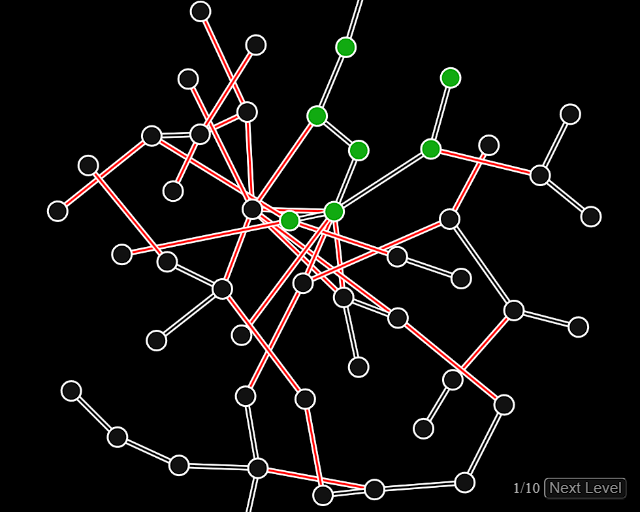

# Network Delivery

This is my entry for Ludum Dare 53. The theme was "Delivery".

[Rate here](https://ldjam.com/events/ludum-dare/53/network-delivery)

The goal is to de-tangle the network until all nodes are connected with non-crossing connections.

Originally wanted to have you route packages through the network, but got distracted by fiddling with the auto-layouting code.

## Controls

- left click to drag nodes
- right click to move view
- scroll to zoom

## Library/Engine

none, plain JS and canvas 2D

## Tools
- [Visual Studio Code by Microsoft](https://code.visualstudio.com/)
- [Google Chrome](https://www.google.com/chrome/)
